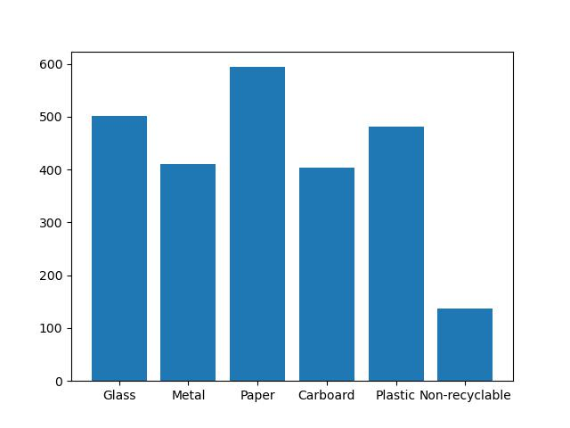

# Trash sorter
Celem projektu jest stworzenie sieci neuronowej, której zadaniem będzie rozpoznawanie i kategoryzowanie „śmieci” na zdjęciach z wybranego datasetu. Do tego celu użyjemy biblioteki tensorflow z interfejsem keras.

Dane do szkolenia znaleźliśmy na internecie (githubie) pod linkiem: 
> https://github.com/garythung/trashnet/blob/master/data/dataset-resized.zip

Są one na licencji MIT.
Podzielone są one na klasy:

* Glass: 501
* Metal: 410
* Paper/cardboard: 594 + 403 = 997
* Plastic: 482
* Non-recyclable: 137

## Wykres z podziałem.

## Razem `2527` zdjęć
Informacji na temat machine learningu szukamy na stronie API keras oraz biblioteki tensorflow

> https://www.tensorflow.org/tutorials/load_data/images
https://www.tensorflow.org/guide/keras/save_and_serialize
https://www.tensorflow.org/tutorials/quickstart/beginner

oraz pod linkami i tutorialami na Youtube
> https://www.techtarget.com/searchenterpriseai/feature/How-to-build-a-machine-learning-model-in-7-steps
https://www.edureka.co/blog/classification-in-machine-learning/