# Trash sorter

Celem projektu jest stworzenie sieci neuronowej, której zadaniem będzie rozpoznawanie i kategoryzowanie „śmieci” na zdjęciach z wybranego datasetu. Do tego celu użyjemy biblioteki tensorflow z interfejsem keras.

## Dane do szkolenia 

Dane do szkolenia znaleźliśmy na internecie (githubie) pod linkiem: 
> https://github.com/garythung/trashnet/blob/master/data/dataset-resized.zip

Są one na licencji MIT.
Podzielone są one na klasy:

### Początkowy rozkład danych

* Glass: 501
* Metal: 410
* Paper/cardboard: 594 + 403 = 997
* Plastic: 482
* Non-recyclable: 137

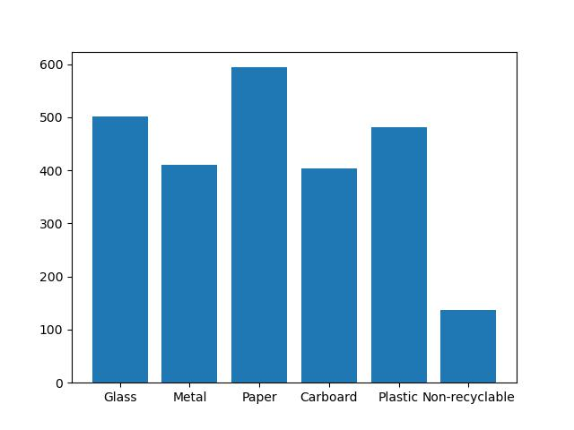

#### Razem `2527` zdjęć

### Ostateczny rozkład danych

* Glass: 694
* Metal: 799
* Paper: 594
* Plastic: 482
* Cardboard: 403

#### Razem `2972` zdjęcia

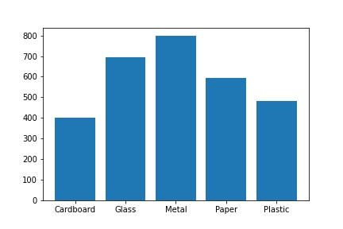
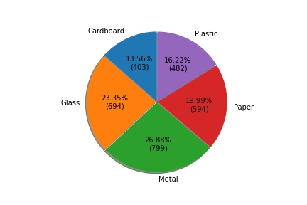

Zauważalnie zmieniły się ilości konkretnych danych, usunięta została klasa non-recyclable oraz wydzielone 2 oddzielne klasy cardboard, paper. Zdecydowaliśmy się na taki podział, ponieważ w ten sposób nie ma klas, które w znaczny sposób odstają ilościowo od reszty (wcześniej działo się tak w przypadku choćby non-recyclable)

__Informacji na temat machine learningu szukaliśmy na stronie API keras oraz biblioteki tensorflow__
> https://www.tensorflow.org/tutorials/load_data/images
https://www.tensorflow.org/guide/keras/save_and_serialize
https://www.tensorflow.org/tutorials/quickstart/beginner

oraz pod linkami i tutorialami na Youtube
> https://www.techtarget.com/searchenterpriseai/feature/How-to-build-a-machine-learning-model-in-7-steps
https://www.edureka.co/blog/classification-in-machine-learning/

Stworzyliśmy także minimalistyczną aplikację umożliwiającą ładowanie zdjęc użytkownika w celu ich rozpoznania przez sieć neuronową.
Znajduje się ona w repozytorium github pod linkiem:
>https://github.com/bbochomulski/trash-sorter/blob/model_testing/frame.py

## Szczegóły
Aby wykonać zadanie wybraliśmy sieć konwolucyjną, jako że była ona polecana do zadań związanych z rozpoznawaniem obrazu. 
Model nasz przyjmuje obrazy o parametrach `224x224` piksele.
Początkowo pracowaliśmy na obrazach w większej rozdzielczości lecz znacząco spowalniało to proces uczenia modelu 
Wykorzystujemy także augmentację w celu zwiększenia liczby danych, na których jesteśmy w stanie trenować model

## Przebieg

Stworzyliśmy model sieci neuronowej, który był dopracowywany w 6 kolejnych wersjach:
* hindus_v4  
* hindus_v5  
* hindus_v6  
* hindus_v7  
* hindus_newdataset  
* hindus_1204  

ostateczną wersją modelu jest hindus_1204, osiągający skuteczność na poziomie około 94%

### Zestawienie parametrów kolejnych modeli:
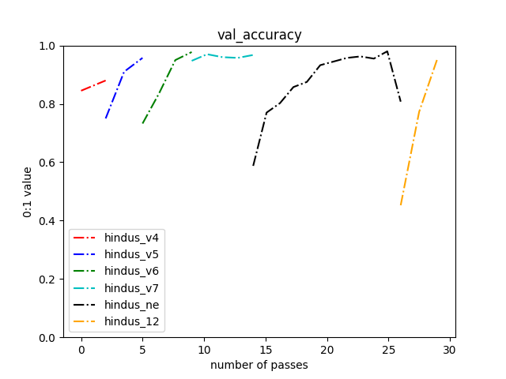
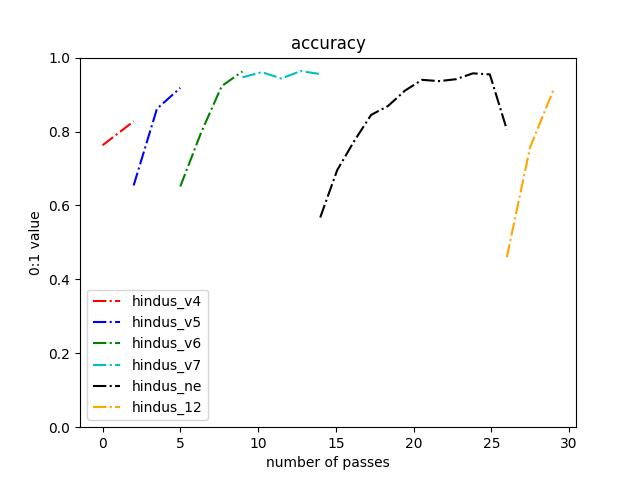
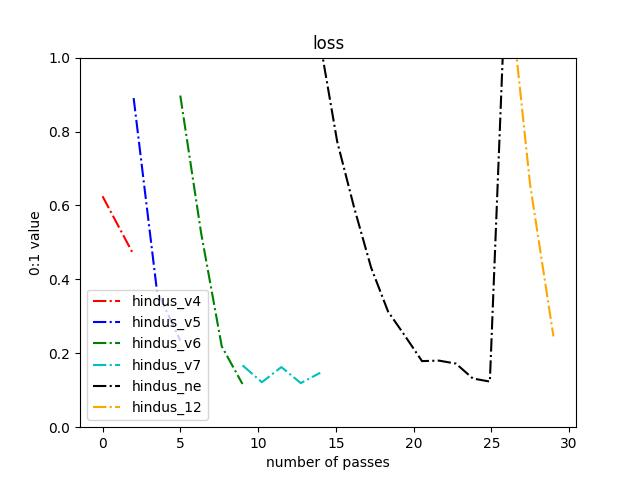
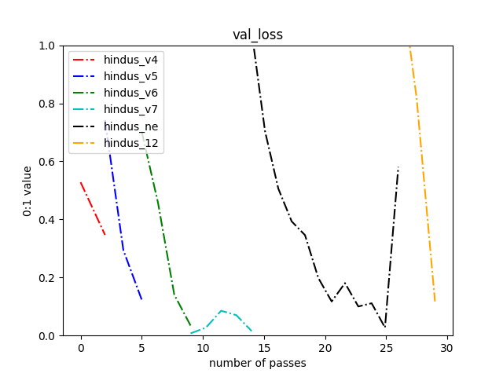

### Confusion matrix oraz zauważalne wnioski
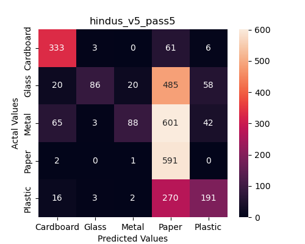
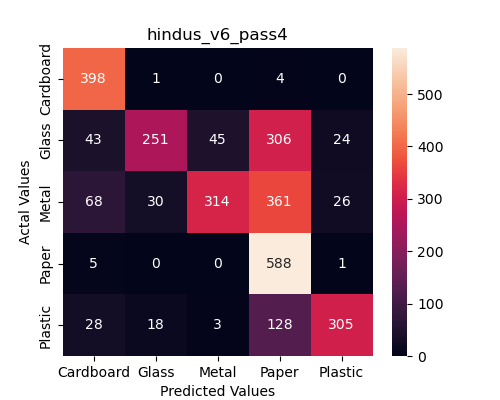
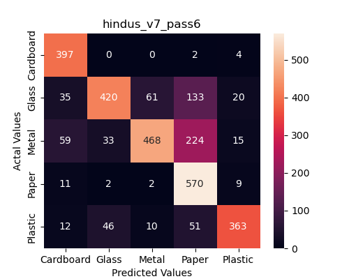
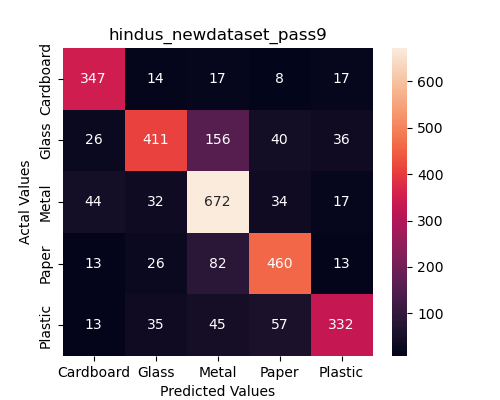
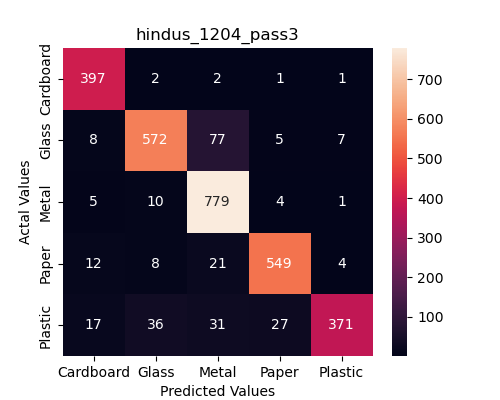
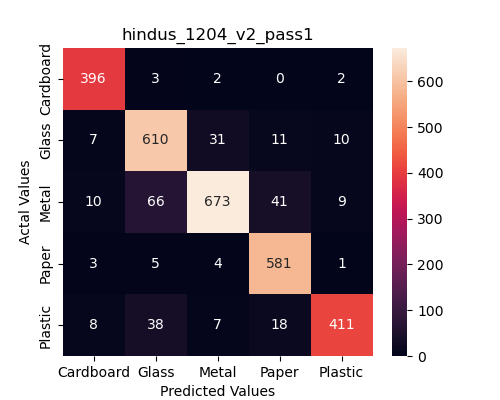

Po przeanalizowaniu confusion matrix dla każdej wersji modelu, widać, że nasze starania idą w dobrą stronę, ponieważ pierwsza wersja modelu stosunkowo często myliła obrazy. 
Wraz z kolejnymi wersjami trend ten zanikał. 
Ostateczna wersja modelu dobrze rozpoznaje obrazy, co widać na ostatnim wykresie (idealną styuacją jest, gdy wszystkie obrazy z danej klasy są na głównej przekątnej macierzy)
